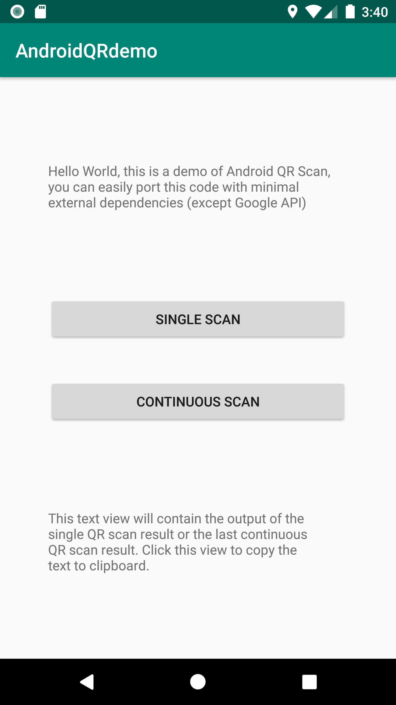

# Android QR demo
Android QR demo with minimal external dependencies (except Google API).

You can view the QR raw text and copy into clipboard.

 

You can easily import the code into any Android project for scanning QR code.
